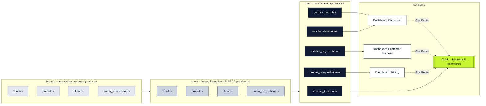

# vitrine. · Plataforma de dados do e-commerce

**Do dado cru à pergunta em português.** Um lakehouse completo no Databricks — bronze → silver →
gold — que termina em três dashboards AI/BI e em um agente do Genie que responde às diretorias sem
que ninguém escreva SQL.

> Projeto de estudo sobre a marca fictícia **Vitrine**. Os dados cobrem **13/12/2025 a 11/01/2026**
> e são sintéticos; a engenharia, as regras de qualidade e os testes são reais e reproduzíveis.

---

## O resultado em números

| | |
|---|---|
| **R$ 974.077,28** | receita do período, fechando em todas as camadas e nos 3 dashboards |
| **3.020 vendas · 50 clientes · 215 produtos** | conferidos contra a origem a cada execução |
| **5 tabelas gold · 70 colunas** | 100% com tipo e `COMMENT` explicando unidade, cálculo e armadilha |
| **18 testes de qualidade** | rodam depois do pipeline, sobre o que foi publicado |
| **10/10 + 2/2** | placar do agente do Genie: 10 perguntas com número conferido e 2 que ele **recusa** sem inventar |
| **4 redes de proteção** | expectations, testes de dados, validador de dashboards, validador do Genie |

---

## Arquitetura



Tudo em **um único Lakeflow Declarative Pipeline serverless**, catálogo `projetoecomerce`. As
dependências entre camadas são implícitas — o pipeline resolve o grafo pelo nome da tabela no
`spark.read.table` / `FROM`.

---

## As decisões que definem o projeto

### 1. Problema de qualidade se **marca**, nunca se descarta

Apagar uma venda suja é apagar receita. A silver nunca joga linha fora: ela **marca** o problema em
uma coluna booleana e **mede** com `@dp.expect` (modo warn).

| Problema conhecido | Volume | Como aparece |
|---|---|---|
| Venda de produto fora do catálogo | 20 vendas · R$ 4.240,01 | `produto_cadastrado = false`, categoria "Não cadastrado" |
| Venda antes da data de cadastro do produto | 5 vendas · R$ 325,88 | `venda_antes_do_cadastro = true` |
| Cotação de concorrente suspeita | 55 cotações em 15 produtos | `possui_preco_suspeito = true` |
| Nome de cliente com pronome de tratamento | 11 clientes | corrigido; original preservado |

`@dp.expect` conta as linhas **saudáveis**, então a expectation afirma o estado bom
(`venda_depois_do_cadastro = NOT venda_antes_do_cadastro`) e a métrica de falha é exatamente a
contagem do problema. **Expectation vermelha esperada não é regressão** — o
[`BASELINE.md`](projeto_ecommerce/BASELINE.md) diz qual é o número certo de cada uma.

### 2. A gold é escrita para ser lida por uma IA

Cada uma das 70 colunas carrega tipo e `COMMENT` com unidade, regra de cálculo e a armadilha que
evita erro: o que significa zero, o que significa nulo, quais valores uma coluna categórica assume e
**o que a coluna não é**. Sem o tipo declarado, o Databricks descarta o comentário em silêncio.

> `ticket_medio` — "Valor médio de **uma** venda, em reais (R$). Cálculo: receita total dividida
> pelo número de vendas — nunca média de médias. **Não** é o preço unitário."

É esse texto que o Genie lê para escrever SQL. Comentário vago = resposta adivinhada.

### 3. Dinheiro é `DECIMAL(10,2)`, com cast **antes** da multiplicação

Em `double`, a soma de milhares de linhas não fecha com o total conferido pelo negócio. Aqui fecha:
os mesmos R$ 974.077,28 aparecem na silver, em quatro tabelas gold e nos três dashboards.

---

## As três diretorias

| Dashboard | Pergunta que responde | Tabela principal |
|---|---|---|
| **Comercial** | Quanto vendemos, quando, em qual canal e com quais produtos? | `vendas_detalhadas` |
| **Customer Success** | Quem são os melhores clientes e onde estão? | `clientes_segmentacao` |
| **Pricing** | Estamos mais caros que o mercado, e em quais produtos agir? | `precos_competitividade` |

Os três seguem o **Vitrine Design System**: paleta de tokens, Figtree, cantos de card em 20px,
wordmark com o ponto em lime e copy em português do Brasil, sentence case, tratando quem lê por
"você". A identidade não é opinião de quem mexe no dashboard — é checada pelo validador.

Três achados que os dashboards entregaram prontos:

- **Quarta-feira vende mais que sábado.** Pelo total sábado lidera, mas o período tem 5 sábados e só
  4 quartas. Pela **receita média por dia**, quarta ganha (R$ 34.753,61 × R$ 32.675,91).
- **O maior bloco de receita não é o VIP.** Os 10 VIP fazem 27,0%; os 25 TOP_TIER fazem
  **50,6% (R$ 493.061,13)**. Estratégia só-VIP cuida de um quarto do faturamento.
- **Não existe problema sistêmico de preço.** A categoria mais cara está +1,24% do mercado. O risco
  real são **20 produtos**, e 71,8% dele está em **um só**.

---

## 🍒 O Genie: a diretoria pergunta sozinha

Um único agente — **"Diretoria E-commerce"** — atende as três diretorias, versionado como código em
[`src/genie/diretoria_ecommerce.geniespace.json`](projeto_ecommerce/src/genie/diretoria_ecommerce.geniespace.json).

Ele sabe apenas o que o projeto ensinou: as 5 tabelas gold, **2.481 caracteres** de instrução de
negócio (o que não cabe num `COMMENT`), 4 SQL de exemplo para as contas que a IA erra, a medida de
ticket médio como snippet e 6 perguntas de partida.

**E ele sabe dizer não.** Perguntas que os dados não respondem são recusadas sem inventar:

> **"Qual foi o nosso lucro?"** → *"Não há dados de custo, margem, lucro, desconto ou imposto neste
> banco; só existe receita bruta. Não é possível calcular o lucro com as informações disponíveis."*

> **"Quanto vendemos ontem?"** → *"Não é possível responder perguntas sobre 'ontem', pois os dados
> cobrem apenas o período de 13/12/2025 a 11/01/2026. O último dia com vendas é 11/01/2026; deseja
> ver os resultados desse dia?"* — **sem gerar SQL.**

### O placar: 10/10, em 4 rodadas

`python testes/placar_genie.py` abre **uma conversa nova por pergunta** (conversa reaproveitada
esconde regressão), pergunta pela API, roda o gabarito em SQL na gold na hora e compara.

| Rodada | Placar | O que mudou |
|---|---|---|
| 1 | 2/10 | Era bug **do teste**: o gabarito devolve `974077.28` e o Genie responde `R$ 974.077,28` |
| 2 | 8/10 | Gabarito sem a coluna de total; e "clientes por região" era *permissão*, não *obrigação* |
| 3 | 9/10 | Regra virou imperativa — e ainda assim falhou |
| **4** | **10/10 + 2/2** | A regra entrou no **SQL de exemplo**; regra que falha em texto passa como exemplo |

O histórico completo, com o porquê de cada rodada, está em
[`src/genie/PLACAR.md`](projeto_ecommerce/src/genie/PLACAR.md).

---

## Quatro redes de proteção

O que torna o projeto confiável não é o código feliz — é o que impede a regressão silenciosa.

| Rede | O que pega | Quando roda |
|---|---|---|
| `@dp.expect` | problema de qualidade dentro de **uma** tabela, durante a escrita | no pipeline |
| `testes/testes_qualidade.py` | 18 testes **cruzando tabelas**, sobre o que já foi publicado | task 2 do job |
| `testes/valida_dashboards.py` | o que `bundle validate` **não** valida: `fieldName` inexistente, measure fantasma, sobreposição no grid, tema fora do DS, copy sem acento, e colisão de nome measure×coluna | antes do deploy |
| `testes/valida_genie.py` | schema do space, ordem exigida pelo servidor, teto de caracteres, `current_date` no SQL, pergunta que entrega a resposta do teste | antes do deploy |

> **"Deploy passou" não é evidência de nada.** Um `.lvdash.json` com `datasetName` errado deploya
> limpo e quebra só no navegador. Os dois validadores existem exatamente para essa lacuna — e cada
> regra dentro deles é uma cicatriz de um erro que já aconteceu aqui.

---

## Como rodar

Tudo a partir de `projeto_ecommerce/`, sempre com o perfil `AnaliseEcommerce`:

```bash
cd projeto_ecommerce

python testes/valida_dashboards.py                       # validadores locais, antes de tudo
python testes/valida_genie.py

databricks bundle validate --strict -p AnaliseEcommerce  # sempre antes do deploy
databricks bundle deploy -t dev -p AnaliseEcommerce
databricks bundle run pipeline_ecommerce -t dev -p AnaliseEcommerce   # silver + gold, depois os testes

python testes/placar_genie.py                            # placar do Genie: 10/10 + 2/2
```

Validar o grafo sem materializar nada:

```bash
databricks bundle run projeto_ecommerce_etl --validate-only -t dev -p AnaliseEcommerce
```

---

## Mapa do repositório

```
projeto_ecommerce/
├── databricks.yml                      bundle, variáveis e targets (dev/prod)
├── resources/                          pipeline, job, 3 dashboards, Genie space
├── src/
│   ├── projeto_ecommerce_etl/
│   │   └── transformations/
│   │       ├── silver/*.py             PySpark — limpa, deduplica e marca
│   │       └── gold/*.sql              uma tabela por diretoria, 70 colunas comentadas
│   ├── dashboards/*.lvdash.json        3 dashboards AI/BI, tema do Vitrine DS
│   └── genie/                          o space + PLACAR.md das rodadas
├── testes/                             18 testes de dados + 2 validadores + placar do Genie
├── AGENTS.md                           convenções e o PORQUÊ de cada decisão
└── BASELINE.md                         os números de referência
```

`Skills/` traz o **Vitrine Design System** e a skill de dashboards AI/BI que governam a aparência.

---

## Armadilhas que este projeto já pagou

Estão todas documentadas em [`AGENTS.md`](projeto_ecommerce/AGENTS.md), com o porquê. As melhores:

- **Nome de measure não pode ser nome de coluna.** `Receita` sobre a coluna `receita` vira
  `SUM(Receita)` — referência circular. Quebra só no navegador, com `BAD_REQUEST`.
- **Sparkline em counter ligado a `MEASURE()`** faz o KPI exibir o *último período*: o total de
  R$ 974.077,28 virou "R$ 28,21 mil / Jan 11, 2026" sem nenhum aviso.
- **`number` compacta sozinho e ignora `abbreviation`**; `number-currency` põe o símbolo depois do
  número. `R$ 974.077,28` exige `number-plain` + `formatTemplate`.
- **`multilineTextboxSpec.lines[]` é concatenado sem separador** — cada elemento precisa terminar
  em `\n`, ou os parágrafos vêm grudados.
- **O Genie recusa campo desconhecido pelo nome** e exige listas ordenadas por `id` — por isso os
  ids aqui começam com um ordinal.
- **Nunca `current_date()`**: o período é fixo. O validador recusa.

---

## Limites, ditos com todas as letras

- **Vitrine é uma marca fictícia** e os dados são sintéticos. A engenharia é real; o faturamento não.
- A bronze é sobrescrita por outro processo, em horário que este projeto não controla — por isso
  tudo aqui é materialized view em batch e o job **não tem trigger agendado**.
- O `space_id` do Genie está fixo nos três dashboards e **muda em prod**; o validador cobra que os
  três citem o mesmo.
- O separador de milhar aparece como espaço (`974 077,28`) quando o idioma do workspace é Português
  de Portugal. É configuração de workspace, não do código.
